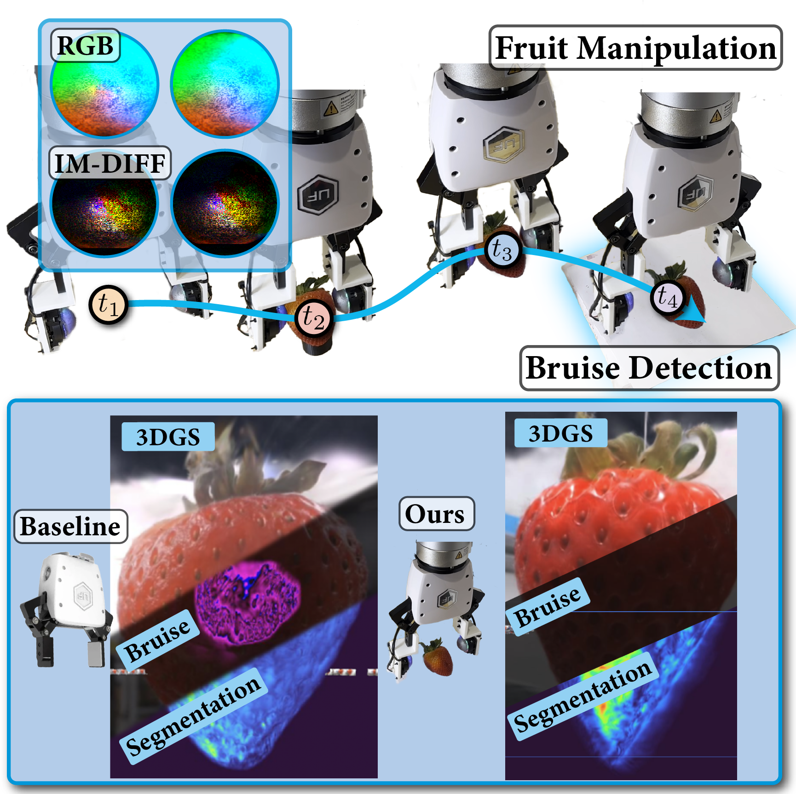

# 🍓 DexFruit: Dexterous Manipulation and Gaussian Splatting Inspection of Fruit

<div align="center">

[](https://dex-fruit.github.io/)
[](http://arxiv.org/abs/2508.07118)
[](LICENSE)

**Gentle robotic fruit manipulation with optical tactile sensing + 3D damage inspection via Gaussian Splatting**

[Aiden Swann](https://aidenswann.com/)\*,
[Alex Qiu](https://www.linkedin.com/in/alexqiu34/)\*,
[Matthew Strong](https://matthewstrong.github.io/),
[Angelina Zhang](https://www.linkedin.com/in/angelina-zhang11/),
[Samuel Morstein](https://www.linkedin.com/in/sammorstein/),
[Kai Rayle](https://www.linkedin.com/in/evan-kai-rayle-372bb01a8/),
[Monroe Kennedy III](https://monroekennedy3.com/)

Stanford University

\*Equal contribution

[Website](https://dex-fruit.github.io/) | [Paper](http://arxiv.org/abs/2508.07118) | [Video](https://www.youtube.com/watch?v=uOivql8unq0)

</div>

---

## 📋 Overview

**DexFruit** enables robots to handle delicate fruits 🍓🍅🫐 like strawberries tomatoes and blackberries, We combine:

- 🤖 **Tactile-aware diffusion policies** for gentle manipulation
- 🎯 **FruitSplat** - a novel 3D Gaussian Splatting method for damage inspection
- 📊 **Rigorous evaluation** over 630+ experimental trials

### Key Results

- ✅ **92% grasping success rate** across strawberries, tomatoes, and blackberries
- 📉 **20% reduction in visual bruising** compared to vision-only baselines
- 🎯 **31% improvement** in grasp success on challenging fruits
- 📷 **Quantitative 3D damage analysis** using only a webcam!

<div align="center">
  
</div>

---

## 🔦 Highlights

### Tactile-Informed Diffusion Policy

We integrate **optical tactile sensing** (DenseTact sensors) with **diffusion policies** to achieve gentle, damage-free fruit manipulation. Our method intelligently switches between vision and tactile modalities during grasping.

### FruitSplat: 3D Damage Inspection

**FruitSplat** uses 3D Gaussian Splatting to create high-resolution 3D models of fruit, enabling:
- Photorealistic 3D reconstruction from webcam videos
- Automated bruise detection and segmentation
- Quantitative damage metrics (% bruised surface area)

---

## 🔧 Installation

### Prerequisites

- Python 3.10+
- CUDA 11.8+ 
- ROS2 Humble

### Setup

```bash
# Clone the repository
git clone https://github.com/swannaiden/dexfruit.git
cd dexfruit

# Set up Universal Manipulation Interface environment
cd universal_manipulation_interface

# Create conda environment from UMI
conda env create -f conda_environment.yaml
conda activate umi

# Install additional dependencies for DexFruit
pip install nerfstudio  # For FruitSplat
pip install opencv-python rich tqdm natsort h5py zarr


```

### Hardware Requirements (Optional)

For running on real hardware:
- xArm7 robotic arm
- 2x DenseTact optical tactile sensors
- Intel RealSense D435i camera
- 3DConnexion SpaceMouse (for teleoperation)

---

## 🚀 Quick Start

### 1. Data Collection

Collect demonstration data using teleoperation:

```bash
# Launch data collection pipeline
cd dt_ag/data_collection_ros2/rs_dt
ros2 launch launch_rs_zed_dt.py

# In a new terminal, teleoperate with SpaceMouse
cd dt_ag/data_collection_ros2
python xarm_dt_spacemouse_ros2.py
```

Data will be saved as HDF5 files in `demo_data/`.

### 2. Convert HDF5 to Zarr

```bash
cd dt_ag/post_processing
python hdf5_to_zarr_full.py
```

This converts your demonstration data to Zarr format for training.

### 3. Train Diffusion Policy

```bash
bash universal_manipulation_interface/train.sh
```

The trained model checkpoints will be saved in the `data/outputs/` directory.

### 4. Run Inference

```bash
# Launch ROS2 nodes (RealSense + DenseTact publishers)
cd dt_ag/inference
ros2 launch densetact_launch_inference.py

# In a new terminal, run the policy
python 2d_dp_densetact_inference.py
```

**Keyboard Controls:**
- `p` - Pause policy execution
- `u` - Unpause/resume policy
- `r` - Reset robot to home position

### 5. Evaluate with FruitSplat

TODO

## 📝 Citation

If you find DexFruit useful in your research, please cite our paper:

```bibtex
@article{swann2025dexfruit,
  title={DexFruit: Dexterous Manipulation and Gaussian Splatting Inspection of Fruit},
  author={Swann, Aiden and Qiu, Alex and Strong, Matthew and Zhang, Angelina and
          Morstein, Samuel and Rayle, Kai and Kennedy III, Monroe},
  journal={arXiv preprint},
  year={2025}
}
```

---

## 🙏 Acknowledgments

- Diffusion Policy code from [UMI](https://github.com/real-stanford/universal_manipulation_interface)

---

## 🔗 Links

- 🌐 **Website**: [https://dex-fruit.github.io/](https://dex-fruit.github.io/)
- 📄 **Paper**: [Available on arXiv](http://arxiv.org/abs/2508.07118)
- 🎬 **Videos**: [Supplementary videos](https://www.youtube.com/watch?v=uOivql8unq0)
- 📧 **Contact**: {swann, aqiu34}@stanford.edu

---


<div align="center">

Made with ❤️ at Stanford University

🍓 **Handle fruit gently, just like humans do!** 🍓

⭐ Star us on GitHub if you find this useful! ⭐

</div>
